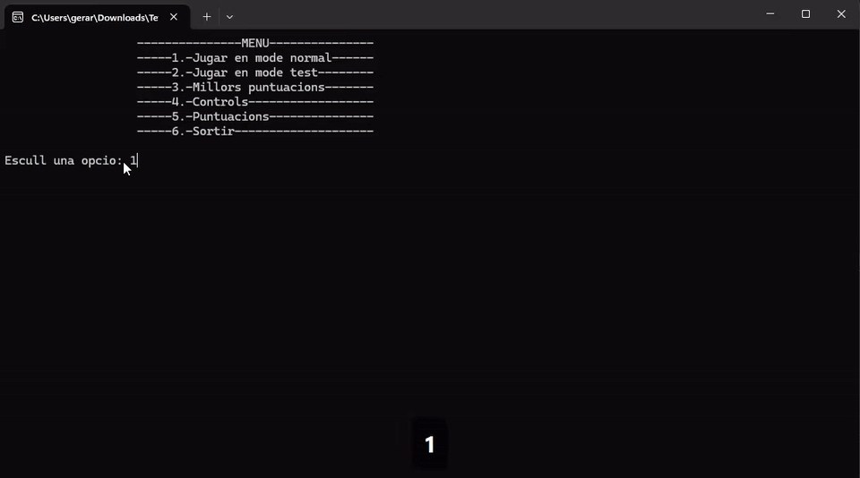

# Tetris



A Tetris clone written in C++ with SDL2. It includes a playable normal mode, an automated test mode that replays a game from files, a level system with increasing speed, sound effects and a persistent high score table.

The project focuses on object-oriented design and manual memory management: the game logic is split into independent classes (board, piece, game, match) and the move and piece queues are implemented as custom linked lists instead of STL containers.

## Features

- All 7 classic tetrominoes (O, I, T, L, J, Z, S) with clockwise and counterclockwise rotation.
- Collision detection for movement and rotation against walls, floor and placed blocks.
- Line clearing with gravity for the rows above.
- Soft drop and hard drop.
- 10 difficulty levels: the fall speed increases every 1,000 points.
- Score system based on cleared lines, placed pieces and hard drops.
- Pause and resume during a game.
- **Test mode**: loads an initial board, a fixed sequence of pieces and a list of moves from text files and plays them automatically, making the game logic reproducible and easy to verify.
- High score table saved to disk and sorted on load.
- Original chiptune rendition of *Korobeiniki* (public domain) as background music, and a game over sound.

## Tech Stack

| Area | Tools |
| --- | --- |
| Language | C++ |
| Graphics and input | SDL2, SDL2_image, SDL2_ttf, libpng |
| Audio | WinMM (`PlaySound`) |
| IDE / build | Visual Studio 2019 or later (uses the installed default toolset), x86  |
| Platform | Windows |

## Architecture

```
main
 └── Tetris          menu, game loop, high scores
      └── Partida    match state: score, level, timing, input / test moves
           ├── Joc           game rules: spawn, move, rotate, drop, place
           │    ├── Tauler   21x12 board, collisions, line clearing
           │    ├── Figura   tetromino shape, position and rotation
           │    └── CuaFigura    linked-list queue of pieces (test mode)
           └── CuaMoviment       linked-list queue of moves (test mode)
```

- **Tetris**: runs the main menu, the frame loop with delta time (`SDL_GetPerformanceCounter`), pause handling and the high score list (`std::list` kept in descending order).
- **Partida**: updates the match every frame, applies the fall timer for the current level, reads keyboard input in normal mode or consumes the move queue in test mode, and computes the score.
- **Joc**: applies the rules of the game and coordinates the board with the active piece.
- **Tauler**: stores the board as a color matrix, validates moves and rotations, detects full rows and removes them. Overloads `<<` and `>>` to read and write the board from files.
- **Figura**: stores each piece as a 4x4 matrix and rotates it through matrix transposition plus row or column reversal.
- **GraphicManager**: singleton that loads and draws sprites and fonts.

## Game Modes

**Normal mode**: the player controls the pieces with the keyboard.

**Test mode**: reads three files from `data/Games/`:

| File | Content |
| --- | --- |
| `partida.txt` | Initial piece and initial board state |
| `figures.txt` | Sequence of pieces to spawn |
| `moviments.txt` | Sequence of moves to execute (0 left, 1 right, 2 rotate clockwise, 3 rotate counterclockwise, 4 soft drop, 5 hard drop) |

## Controls

| Key | Action |
| --- | --- |
| ← / A | Move left |
| → / D | Move right |
| ↑ / W | Rotate clockwise |
| ↓ / S | Rotate counterclockwise |
| C | Soft drop |
| Space | Hard drop |
| P | Pause / resume |
| Esc | Back to menu |

## Scoring

| Action | Points |
| --- | --- |
| Clear 1 line | 100 |
| Clear 2 lines | 150 |
| Clear 3 lines | 175 |
| Clear 4 lines | 200 |
| Place a piece | 10 |
| Hard drop | 30 |

## Project Structure

```
0. C++ Code/
   Logic Game/       game logic classes
   Graphic Lib/      SDL2 wrapper for video, keyboard, sprites, sound and fonts
1. Resources/
   data/Graphics/    board, background and block sprites
   data/Fonts/       FreeSans font
   data/Games/       test mode files and high scores
   music.wav         background music
   gameover.wav      game over sound
2. Platforms/
   0. Windows Desktop/   Visual Studio solution and SDL2 / libpng headers
docs/
   gameplay.gif      gameplay preview
```

## Build and Run

1. Clone the repository.
2. Open `2. Platforms/0. Windows Desktop/MP_Practica.sln` in Visual Studio 2019, 2022 or 2026 with the *Desktop development with C++* workload.
3. Select the platform and configuration (the SDL2 and libpng libraries are included in `extlibs/` and `Program/`).
4. Build the solution. The executable is generated in `Program/`, and a post-build step copies `data/` and the sound files next to it.
5. Run it with **F5** from Visual Studio or by opening `Program/MP_Practica.exe`.
6. Choose an option from the console menu. The game window opens when a match starts.

## Credits

The graphics wrapper in `Graphic Lib/` was provided as base material for the course. The game logic, class design, data structures, test mode, scoring and level system were implemented for this project.

## License

This project is available under the MIT License.

Tetris is a trademark of The Tetris Company. This is a non-commercial educational project.
